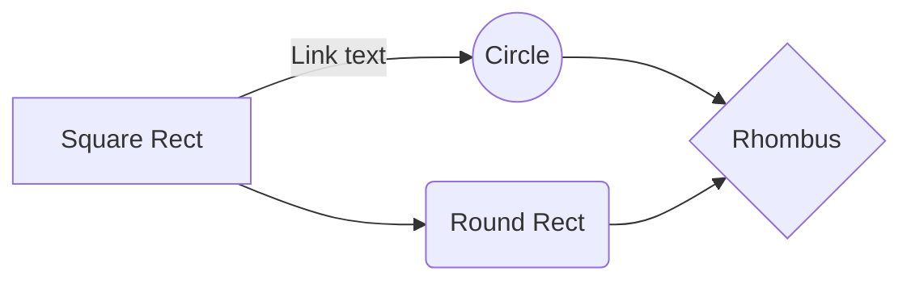

**ISPAPI Tool Documentation**

**Contents**
* TOC
{:toc}

# Introduction

This site provide documentation for the ispapicli tool. Here you will find documentation for installing on different operation systems, namely windows, mac, and ubuntu. 

In general, this tool consist of two major parts: Graphical User Interface (GUI) and Shell (or so-called command line interpreter).

# What Does This Tool Offer?

This tool enable you to connect to our back-end API and manage your account through GUI or Command Line Interface.

# Tool Features/Commands

This section provides you with a quick introduction to all the features included in this tool.

## Login/logout and session management

*   Login/logout management instead of sending your login credentials everytime you requrest a command
*   Each login session is valid for 60 minutes
*   Accessible from GUI and Shell

## Graphical User Interface

The graphical user interface has many features:

# How to use it?

Basically this tool can be used in two ways: The GUI and Shell

## Run it via Shell

Once you 

## Run it via GUI

# Download and Installation

## Windows

## Mac OS

## Ubuntu

